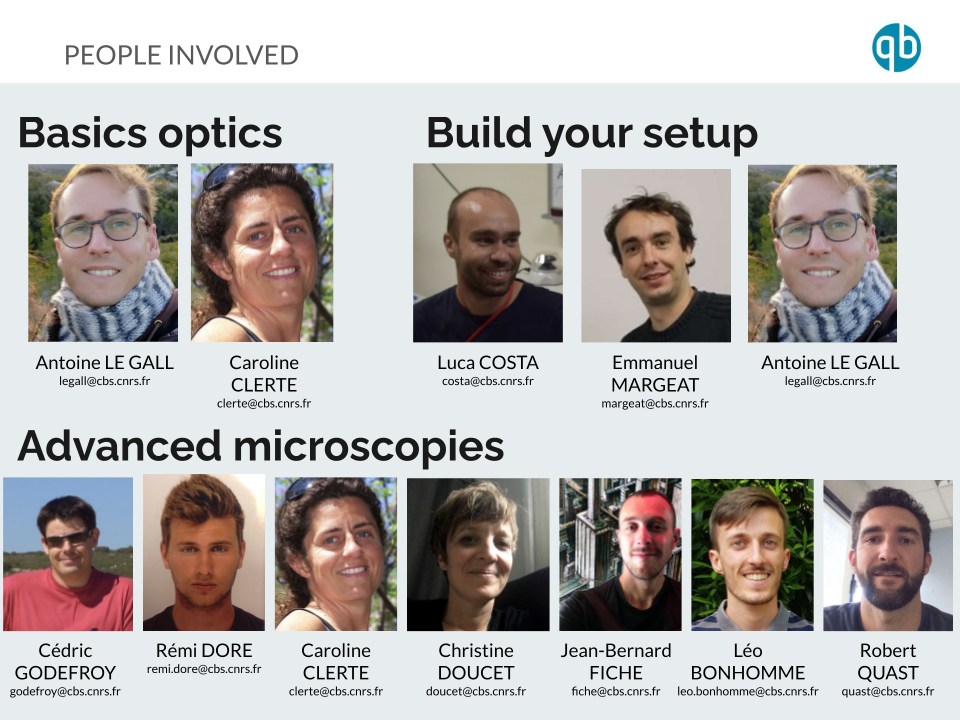

# UE Imaging Biological Systems 2023-2024

Repository of the UE Imaging Biological Systems - qbio master curriculum - University of Montpellier

[TOC]

## OVERVIEW

See [here](UE_short_overview/Intro_BioImaging_2022.pptx.pdf) for the slides introducing the UE.

The UE Imaging Biological Systems is organized around three sections with increasing levels of complexity:

​	In section I. the students will be taught the good practices when handling potentially hazardous or fragile instruments and will learn how to align optics and characterize them. 

​	In section II. they will design and build an imaging setup (among which a TIRF, a confocal or an AFM). Then they will use it to run simple experiments.

​	In section III. the students will use advanced microscopes used routinely by researchers at CBS. They will design the experiment, participate in the sample preparation and then run the experiment and analyse the data.

| Sections | Hours | Evaluations | Teachers | Description |
| ------------ |----| ------ | ------- | ----------- |
| I. Basics | 5h CM + 4h TP = 9 hours** | None |         | Safety & Good practices |
| II. Build a setup | 4h TD + 12h TP = **16 hours** | Written report + oral restitution |         | TIRF/Confocal/AFM |
| III. Practicals | 5h TD + ~2x5h TP = **15 hours** | Written report + oral restitution |         | SMLM/FCS/AFM |

## Ressources

Here are some ressources that may be useful for the praticals of this UE:

- [Basics in optical microscopy](Ressources/Optics_basics/20210128_Basics_in_optical_microscopy_M1.pdf) 
- [Dye labeling](Ressources/Dye_labeling/Cours_imaging_Introduction_to_dyes_and_labeling_Margeat.pdf)  
- [Basics in electronics](Ressources/Electronics/qbio_UE_introduction_electronics.pdf) 
- [Basics in AFM](Ressources/AFM/qbio_UE_introduction_AFM.pdf) 
- [Single Particle Tracking](Ressources/Tracking/20201202_Microscopies_avancées_Single_Particle_Tracking.pdf) 
- Super resolution microscopy - [SMLM](Ressources/Super_resolution_methods/20201021_part1.pdf), [SIM](Ressources/Super_resolution_methods/20181014_part3.pdf)  and [STED](Ressources/Super_resolution_methods/20181014_part2.pdf) 
- [FRET](Ressources/smFRET/Cours_Single_molecule_FRET_margeat.pdf) 
- [Fluorescence fluctuations](Ressources/Fluorescence_fluctuations/Cours_Fluctuation_microscopies_margeat.pdf)
- [N&B](Ressources/Fluorescence_fluctuations/Number_and_brigthness.pdf)  

## Organization

**Instructors**:

ALG : Antoine Le Gall
CC : Caroline Clerté
CD : Christine Doucet
CG : Cédric Godefroy
EM : Emmanuel Margeat
JBF : Jean-Bernard Fiche
LB: Léo Bonhomme
LC : Luca Costa
RD : Rémi Doré
RQ : Robert Quast
PEM : Pierre-Emmanuel Milhiet

### Section #1-Basics
| Date | Schedule | Subject | Location | Instructors|
| ------------ |----| ------ | ------- | ----------- |
| 06/10/23 | 14:00-16:00 | CM : [N&B](Number_and_brigthness/Number_and_brigthness.pdf) and [smFRET](smFRET/smFRET.pdf), [Electronics](Electronics/qbio_UE_introduction_electronics.pdf), ... |Bungalow 16p |EM, LC |
| 06/10/23  |16:00-17:00| CM : [Laser safety](/Intro_Laser_safety/Intro_Laser_safety.pdf) | Bungalow 16p | CC |
| 10/10/23 | 09:00-11:00 | TD : [Optics basics tutorials](Tutorials_Optics_basics/Tutorials_Optics_basics.pdf) | Bungalow 16p | ALG |
| 18/10/23 |09:00-13:00| TP : [Optics basics](Pratical_Optics_basics/TP_optics_basics.pdf) | qBio | ALG      |

**<u>Homeworks</u>**: 

* Prepare the TD : [Optics basics tutorials](Tutorials_Optics_basics/Tutorials_Optics_basics.pdf) BEFORE the session!
* For the rest : None! Just come as you are :-). For the practicals of [Optics basics](Pratical_Optics_basics/TP_optics_basics.pdf) you might want to define binomes (+1 trinome if you are an odd number) before the session.

### Section #2-Build a setup
| Date | Schedule | Subject | Location | Instructors|
| ------------ |----| ------ | ------- | ----------- |
| 25/10/23 |09:00-11:00| TD : Intro to [building your setup](Build_your_setup/Build_your_setup.pdf) | Bungalow 16p / 12p | ALG, EM |
| 27/10/23 |14:00-16:00| TD : Troubleshooting| qBio room | ALG, EM,  |
| 07/11/23 |08:00-12:00| TP : [Building your setup](Build_your_setup/Build_your_setup.pdf) | qBio room | ALG, EM  |
| 08/11/23 |08:00-12:00| TP : [Building your setup](Build_your_setup/Build_your_setup.pdf) | qBio room | ALG, EM  |
| 08/11/22 |14:00-18:00| TP : [Building your setup](Build_your_setup/Build_your_setup.pdf)-acquisition | qBio room | ALG, EM  |
| 09/11/23 |09:00-12:00| TP : [Building your setup](Build_your_setup/Build_your_setup.pdf)-Demo | qBio room | ALG, EM, LC, CD  |
| 21/11/23 |TBD| Report debriefing | qBio room | ALG, EM, LC, CD |
| 28/11/23 |TBD| Oral restitutions #1 | qBio room | ALG, EM, LC, CD |

**<u>Homeworks</u>**: 

* Pick the setup you want to build among the [two setups](Build_your_setup/Build_your_setup.pdf) (2 students per setup for the confocal and 2 students for the TIRF)
* During the "TD : Intro to [building your setup](Build_your_setup/Build_your_setup.pdf)'' you will design the setup with the teacher, however it is highly recommended that you think about the design before the session.
* During the "TD : Troubleshooting" you will validate the last details of the design. You should have a well thought design BEFORE the session.
* During the TP you will take notes and acquire data that you may need to process/analyse for the written report and the oral restitutions.
* During the last practical session of 09/11/23 each group will present their setup (explain and guide the others to use their setup and run an acquisition) and give a demo to other students. Students will be encouraged to ask questions.
* Written report guidelines:
  * introduction of the technique, justify the design (with your calculations!), description of the building process + troubleshooting, proof of concept experiment, conclusion + discussion
  * It is strongly advised that you start writing the report as soon as you start reflecting on the setup design!
  * Written report restitution deadline : **==TBD==**
* Oral restitutions guidelines:
  * 10 minutes (12 minutes for the trinome) of presentation by each binome/trinome
  * 20 minutes of questions by the students and teachers.
  * Oral restitution  : **==28/11/2022==**

### Section #3-[Advanced practicals](Practicals_Advanced_microscopy/Practicals_Advanced_microscopy.pdf)

Students will choose a technique among AFM/Airyscan/FCS/FRET to run experiments. Students will be in charge of designing the experiment, prepare the samples, run the acquisition and perform analysis. Ressources for the respective practicals may be found [HERE](Practicals_Advanced_microscopy/).

| Date | Schedule | Subject | Location | Instructors|
| ------------ |----| ------ | ------- | ----------- |
| 30/11/23 |14:00-16:00| TD : Check exp design| CBS | JBF/CD, CC, RQ/LB, RD/CG |
| 05/12/23 |10:00-17:00| TP : Sample preparation + Acquisition #1 | CBS | JBF/CD, CC, RQ/LB, RD/CG |
| 06/12/23 |10:00-17:00| TP : Sample preparation + Acquisition #2 | CBS | JBF/CD, CC, RQ/LB, RD/CG |
| 15/12/23 |TBD| Report debriefing | TBD | JBF, CD, ALG, CC, EM, RQ, LB, LC, CG, RD |
| 20/12/23 |14:00-17:00| Oral restitutions #2 | Conference room | JBF, CD, ALG, CC, EM, RQ, LB, LC, CG, RD |

**<u>Homeworks</u>**:

* Written report guidelines:
  * Students will prepare a written report in the format of a scientific articles emphasizing the methodology and assuming it is an original technique unknown from the community.
  * Written report restitution deadline : **==TBD==**

* Oral restitutions guidelines:
  * 10 minutes (12 minutes for the trinome) of presentation by each binome/trinome
  * 20 minutes of questions by the students and teachers.
  * Oral restitution  : **==20/12/2023==**

