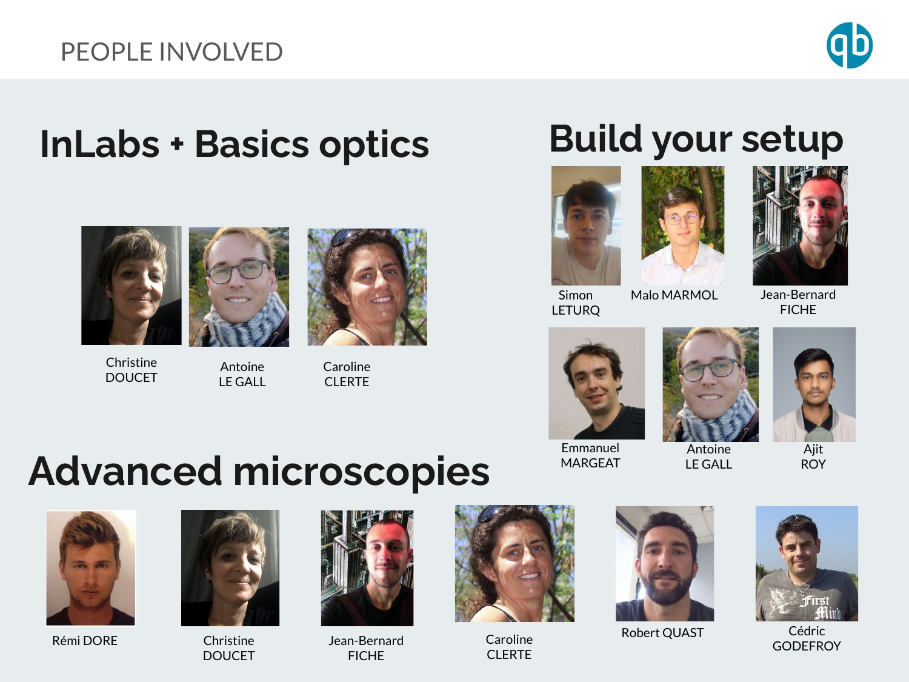

# UE Imaging Biological Systems 2026-2027

Repository of the UE Imaging Biological Systems - qbio master curriculum - University of Montpellier

[TOC]

## OVERVIEW

See the [2026-2027 introductory slides](UE_short_overview/Intro_BioImaging_2026.pdf) for the philosophy and organization of the UE.

The UE Imaging Biological Systems is organized around three sections with increasing levels of complexity:

​	In section I. the students will be taught the good practices when handling potentially hazardous or fragile instruments and will learn how to align optics and characterize them. 

​	In section II. they will design and build an imaging setup (epifluorescence/TIRF, confocal, optical tweezers, or assembly of a commercial microscope with metrology). Then they will use it to run simple experiments.

​	In section III. the students will use advanced microscopes used routinely by researchers at CBS. They will design the experiment, participate in the sample preparation and then run the experiment and analyse the data.

| Sections | Activities | Evaluations |
| -------- | ---------- | ----------- |
| I. Basics | Laser safety and good practice, optics practicals, and 3 hours of seminars on optical microscopy, smFRET and N&B | None |
| II. Build a setup | Design and troubleshooting, followed by 12 hours of practicals; four projects available | Individual assessment during practicals and oral discussions; a final multiple-choice quiz is under consideration |
| III. Advanced microscopy | Experimental design, followed by 12 hours of sample preparation, imaging and analysis; four projects available | Written report + oral restitution in groups |

## Report and presentation guidelines

**Read the relevant guidelines before preparing your report or oral presentation:**

- [Written report guidelines](Guidelines/qBio_reports_guidelines.md): for advanced microscopy only. No written report is required for BYS in 2026-2027.
- [Oral presentation guidelines](Guidelines/qBio_presentations_guidelines.md): separate sections cover advanced microscopy and BYS. For BYS, students are assessed individually on their interactions during practical sessions, their answers to instructors’ questions, and the questions they ask other groups during oral presentations. Advanced microscopy presentations last 12 minutes per pair or 15 minutes for groups of three.

## Ressources

Here are some ressources that may be useful for the praticals of this UE:

- [Basics in optical microscopy](Ressources/Optics_basics/20210128_Basics_in_optical_microscopy_M1.pdf) 
- [Dye labeling](Ressources/Dye_labeling/Cours_imaging_Introduction_to_dyes_and_labeling_Margeat.pdf)  
- [Basics in electronics](Ressources/Electronics/qbio_UE_introduction_electronics.pdf) 
- [Basics in AFM](Ressources/AFM/qbio_UE_introduction_AFM.pdf) 
- [Single Particle Tracking](Ressources/Tracking/20201202_Microscopies_avancées_Single_Particle_Tracking.pdf) 
- Super resolution microscopy - [SMLM](Ressources/Super_resolution_methods/20201021_part1.pdf), [SIM](Ressources/Super_resolution_methods/20181014%20-%20part3.pdf) and [STED](Ressources/Super_resolution_methods/20181014_part2.pdf)
- [Single-molecule FRET](Ressources/Fluorescence/fret.pdf)
- [Fluorescence fluctuations](Ressources/Fluorescence/fcs.pdf)
- [N&B](Ressources/Fluorescence/fcs.pdf)

## Organization

**Instructors**:

- ALG: Antoine Le Gall
- AR: Ajit Roy
- CC: Caroline Clerté
- CD: Christine Doucet
- CG: Cédric Godefroy
- EM: Emmanuel Margeat
- JBF: Jean-Bernard Fiche
- MM: Malo Marmol
- RD: Rémi Doré
- RQ: Robert Quast
- SL: Simon Leturq

### InLab — materials from a separate UE

InLab is a separate UE in which Christine Doucet and Antoine Le Gall teach. Its materials are hosted in this repository to keep the teaching resources in one place.

- [Microscopy data analysis](InLab-Data-analysis/InLab-Data.md)
- [Python resources for image analysis](InLab-Data-analysis/Python%20resources%20for%20image%20analysis.md)
- [Optical ray simulations](InLab-Ray-Simulations/20260930_Inlab_qBio.pdf)

Please refer to the calendar of the InLab UE for its schedule.

### Section #1-Basics

The dates and times below are extracted from the [shared 2026-2027 calendar, S1 tab](https://docs.google.com/spreadsheets/d/19_Bwkybd86P7nmEwTfxF5rR5eIAWM7aKF2rCw9KM3gg/edit?usp=sharing). **The shared calendar is the authoritative reference and takes precedence over this README.**

| Date | Schedule | Subject | Location | Instructors |
| ---- | -------- | ------- | -------- | ----------- |
| 02/10/26 | 13:30–14:30 | CM: [Laser safety](Intro_Laser_safety/Intro_Laser_safety.pdf) | To be confirmed | To be confirmed |
| 07/10/26 | 13:00–17:00 | TP: [Optics basics](Pratical_Optics_basics/TP_optics_basics.pdf) | CBS29 — seminar room | To be confirmed |
| 14/10/26 | 09:30–11:30 | BioImaging theory | CBS29 — seminar room | To be confirmed |
| 16/10/26 | 14:00–15:00 | BioImaging theory | CBS29 — 16-person bungalow | EM |

**<u>Homeworks</u>**: 

* Prepare the TD : [Optics basics tutorials](Tutorials_Optics_basics/Tutorials_Optics_basics.pdf) BEFORE the session!
* For the rest : None! Just come as you are :-). For the practicals of [Optics basics](Pratical_Optics_basics/TP_optics_basics.pdf) you might want to define binomes (+1 trinome if you are an odd number) before the session.

### Section #2-Build a setup
| Date | Schedule | Subject | Location | Instructors |
| ---- | -------- | ------- | -------- | ----------- |
| 16/10/26 | 15:00–17:00 | TD: Introduction to [building your setup](Build_your_setup/Build_your_setup.pdf) | CBS29 — 16-person / 12-person bungalows; CBS60 — GS1 | To be confirmed |
| 23/10/26 | 14:00–16:00 | TD: Troubleshooting design | To be confirmed | To be confirmed |
| 03/11/26 | 08:00–12:00 | TP: Building your setup | Rooms booked; details to be confirmed | To be confirmed |
| 04/11/26 | 08:00–12:00 | TP: Building your setup | Rooms booked; details to be confirmed | To be confirmed |
| 04/11/26 | 14:00–17:00 | TP: Building your setup | Rooms booked; details to be confirmed | To be confirmed |
| 06/11/26 | 09:00–12:00 | TP: Acquisition and setup demonstrations | Rooms booked; details to be confirmed | To be confirmed |
| 25/11/26 | To be confirmed | Oral restitutions #1 | CBS60 — GS1 | To be confirmed |

**<u>Homeworks</u>**: 

* Choose one of the four projects available this year:
  * Build an epifluorescence/TIRF microscope.
  * Build a confocal microscope.
  * Build optical tweezers.
  * Assemble a commercial microscope and perform metrology.
* Choose one advanced microscopy project as well. As far as possible, vary your partners and microscopy techniques between projects.
* Updated project instructions and group sizes will be confirmed.
* During the "TD : Intro to [building your setup](Build_your_setup/Build_your_setup.pdf)'' you will design the setup with the teacher, however it is highly recommended that you think about the concept and the design before the session.
* During the "TD : Troubleshooting" you will validate the last details of the design. You should have a well thought design BEFORE the session.
* During the TP, take notes and acquire data to process/analyse for the oral restitutions.
* During the last practical session, everyone will present their setup (explain and guide the others to use their setup and run an acquisition) and give a demo to other students. Students will be encouraged to ask questions.
* Assessment is individual, including when working or presenting in groups. No written report is required for Build your setup.
  * Assessment will focus on each student's interactions during the practical sessions and oral presentations.
  * During oral discussions, both your answers to the instructors' questions and the questions you ask other groups will contribute to your assessment.
  * A final multiple-choice quiz is under consideration; its inclusion and format remain to be confirmed.
* Oral restitutions guidelines:
  * Read the **BYS practicals** section of the [oral presentation guidelines](Guidelines/qBio_presentations_guidelines.md) before preparing your slides.
  * 10 minutes (12 minutes for the trinome) of presentation by each binome/trinome.
  * 20 minutes of questions by the students and teachers. Students are encouraged to give positive and constructive feedbacks on presentations and to ask questions.
  * Oral restitution : **25/11/2026**

### Section #3-[Advanced practicals](Practicals_Advanced_microscopy/Practicals_Advanced_microscopy.pdf)

Students will choose one of four projects:

1. Image model lipid membranes by correlative AFM and fluorescence microscopy.
2. Study the structural dynamics of the metabotropic glutamate receptor by smFRET.
3. Characterize promoter strength in *E. coli* by N&B.
4. Image nuclear pore complexes in human cells using super-resolution microscopy.

Students will design the experiment, prepare the samples, run the acquisition and analyse the data.

| Date | Schedule | Subject | Location | Instructors |
| ---- | -------- | ------- | -------- | ----------- |
| 30/11/26 | 14:00–16:00 | TD: Check experimental design for sample preparation and acquisition | To be confirmed | To be confirmed |
| 07/12/26 | To be confirmed (end: 17:00) | TP: Advanced microscopy | To be confirmed | To be confirmed |
| 08/12/26 | 09:00–17:00 | TP: Advanced microscopy | To be confirmed | To be confirmed |
| 05/01/27 | To be confirmed (1 h 30 min) | Written report debriefing | To be confirmed | To be confirmed |
| 12/01/27 | 14:00–end to be confirmed | Oral restitutions #2 | CBS60 — GS1 | To be confirmed |

**<u>Homeworks</u>**:

* Written report guidelines:
  * Read the [written report guidelines](Guidelines/qBio_reports_guidelines.md) before starting your report.
  * Students will prepare a written report in the format of a scientific article emphasizing the methodology and assuming it is an original technique unknown from the community.
  * Written report restitution deadline : **11/12/2026**

* Oral restitutions guidelines:
  * Read the **Advanced practicals** section of the [oral presentation guidelines](Guidelines/qBio_presentations_guidelines.md) before preparing your slides.
  * Presentation duration: **12 minutes per pair or 15 minutes for groups of three**.
  * 20 minutes of questions by the students and teachers.
  * Oral restitution : **12/01/2027**
